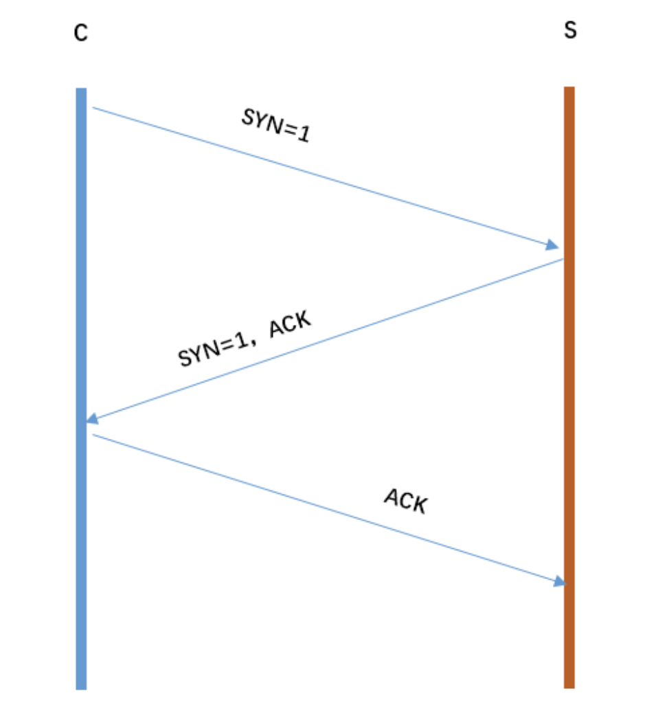

#### http 和 https 的区别
一、HTTP 和 HTTPS 的基本概念

HTTP：超文本传输协议,是互联网上应用最为广泛的一种网络协议。设计 HTTP 最初的目的是为了提供一种发布和接收 HTML 页面的方法。它可以使浏览器更加高效。HTTP 协议是以明文方式发送信息的，如果黑客截取了 Web 浏览器和服务器之间的传输报文，就可以直接获得其中的信息。

HTTPS：是以安全为目标的 HTTP 通道，是 HTTP 的安全版。HTTPS 的安全基础是 SSL。SSL 协议位于 TCP/IP 协议与各种应用层协议之间，为数据通讯提供安全支持。

SSL 协议可分为两层：
         1.SSL 记录协议（SSL Record Protocol），它建立在可靠的传输协议（如TCP）之上，为高层协议提供数据封
           装、 压缩、加密等基本功能的支持。
         2.SSL 握手协议（SSL Handshake Protocol），它建立在 SSL 记录协议之上，用于在实际的数据传输开始前，通
           讯双方进行身份认证、协商加密算法、交换加密密钥等。

二、HTTP 和 HTTPS 的区别？

HTTP 传输的数据都是未加密的，也就是明文的，网景公司设置了 SSL 协议来对 http 协
议传输的数据进行加密处理，简单来说 https 协议是由 http 和 ssl 协议构建的可进行
加密传输和身份认证的网络协议，比 http 协议的安全性更高。

主要的区别如下：
1.HTTPS 协议需要 ca 证书，费用较高。
2.HTTP 是超文本传输协议，信息是明文传输，HTTPS 则是具有安全性的 ssl 加密传输协
  议。
3.使用不同的链接方式，端口也不同，一般而言，http 协议的端口为 80，https 的端口
  为 443
4.http 的连接很简单，是无状态的；
5.HTTPS 协议是由 SSL+HTTP 协议构建的可进行加密传
  输、身份认证的网络协议，比 http 协议安全。

三、https 协议的工作原理

客户端在使用 HTTPS 方式与 Web 服务器通信时有以下几个步骤，
客户使用 https url 访问服务器，则要求 web 服务器建立 ssl 链接。
web 服务器接收到客户端的请求之后，会将网站的证书（证书中包含了公钥），返回或
者说传输给客户端。
客户端和 web 服务器端开始协商 SSL 链接的安全等级，也就是加密等级。
客户端浏览器通过双方协商一致的安全等级，建立会话密钥，然后通过网站的公钥来
加密会话密钥，并传送给网站。
web 服务器通过自己的私钥解密出会话密钥。
web 服务器通过会话密钥加密与客户端之间的通信。

四、https 协议的优点

1.使用 HTTPS 协议可认证用户和服务器，确保数据发送到正确的客户机和服务器；
2.HTTPS 协议是由 SSL+HTTP 协议构建的可进行加密传输、身份认证的网络协议，要比
  http 协议安全，可防止数据在传输过程中不被窃取、改变，确保数据的完整性。
3.HTTPS 是现行架构下最安全的解决方案，虽然不是绝对安全，但它大幅增加了中间人攻
  击的成本。
4.谷歌曾在 2014 年 8 月份调整搜索引擎算法，并称“比起同等 HTTP 网站，采用 HTTPS
  加密的网站在搜索结果中的排名将会更高”。

五、https 协议的缺点

1.https 握手阶段比较费时，会使页面加载时间延长 50%，增加 10%~20%的耗电。
2.https 缓存不如 http 高效，会增加数据开销。
3.SSL 证书也需要费用，功能越强大的证书费用越高。
4.SSL 证书需要绑定 IP，不能再同一个 ip 上绑定多个域名，ipv4 资源支持不了这种消
耗。
#### tcp 三次握手，一句话概括
客户端和服务端都需要直到各自可收发，因此需要三次握手。
简化三次握手：

从图片可以得到三次握手可以简化为：C 发起请求连接 S 确认，也发起连接 C 确认我们
再看看每次握手的作用：第一次握手：S 只可以确认 自己可以接受 C 发送的报文段第
二次握手：C 可以确认 S 收到了自己发送的报文段，并且可以确认 自己可以接受 S 发
送的报文段第三次握手：S 可以确认 C 收到了自己发送的报文段

